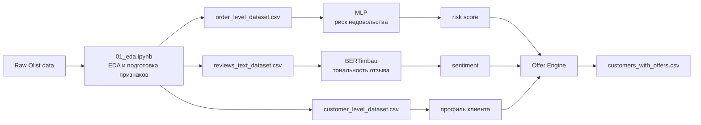

# Групповой проект 5. СМАДИМО. DL.

Это групповой проект по Deep Learning. Мы взяли датасет Olist Brazilian E-Commerce и сделали систему для маркетплейса, которая помогает заранее находить клиентов с риском плохого опыта и подбирать для них оффер.

Идея такая: у Olist очень мало повторных покупок, поэтому бизнесу важно работать над снижением оттока пользователей. Для этого мы используем две связанные модели:

1. табличная MLP-модель предсказывает риск недовольства по заказу;
2. текстовая модель определяет тональность отзыва;
3. offer engine соединяет эти сигналы и выбирает тип предложения клиенту.

## Бизнес-логика

Сначала мы хотели смотреть именно retention: вернулся клиент за 90 дней или нет. Но в EDA стало видно, что почти все клиенты не возвращаются, и такой таргет получается слишком несбалансированным. Поэтому мы взяли более рабочую постановку: предсказывать плохой клиентский опыт через `review_score <= 2`.

Бизнес-смысл: если модель заранее видит высокий риск недовольства, то поддержка или CRM могут быстрее среагировать. Например, дать извинение, скидку, рекомендацию в любимой категории или просто не трогать клиента, если риск низкий.

## Схема системы



## Данные

Датасет: [Olist Brazilian E-Commerce Public Dataset](https://www.kaggle.com/datasets/olistbr/brazilian-ecommerce)

Использовались таблицы с заказами, клиентами, оплатами, товарами, продавцами, категориями и отзывами. После EDA получились три основные таблицы:

- `data/processed/order_level_dataset.csv` — уровень заказа, 98 673 строки;
- `data/processed/customer_level_dataset.csv` — уровень клиента, 96 096 строк;
- `data/processed/reviews_text_dataset.csv` — тексты отзывов, 40 977 строк.

Из EDA основные выводы:

- плохих отзывов около 14.6%;
- у опоздавших заказов доля плохих отзывов примерно 62%;
- проблемные статусы заказа и несколько продавцов внутри заказа сильно повышают риск плохого отзыва;
- отзывы на португальском, поэтому для текстовой модели нужен multilingual подход.

## Табличная модель

Задача: по признакам заказа предсказать `risk_dissatisfaction`, то есть плохой отзыв (`review_score <= 2`).

Чтобы не было утечки таргета, из признаков убрали `review_score`, `has_text` и `comment_len`.

Сравнили baseline и три MLP:

| модель | ROC-AUC |    F1 | recall |
| ------------ | ------: | ----: | -----: |
| Dummy        |   0.504 | 0.153 |  0.153 |
| LogReg       |   0.781 | 0.514 |  0.545 |
| RandomForest |   0.772 | 0.514 |  0.397 |
| MLP-1        |   0.779 | 0.518 |  0.413 |
| MLP-2        |   0.747 | 0.486 |  0.385 |
| MLP-3-reg    |   0.780 | 0.503 |  0.580 |

В offer engine пошла MLP-3-reg, потому что для нашей бизнес-задачи важнее recall: лучше лишний раз заметить рискованного клиента, чем пропустить недовольного.

## Текстовая модель

Задача: по тексту отзыва определить sentiment:

- `negative`, если `review_score <= 2`;
- `neutral`, если `review_score == 3`;
- `positive`, если `review_score >= 4`.

Результаты:

| модель            | f1_macro | recall_neg | ROC-AUC |
| ----------------------- | -------: | ---------: | ------: |
| BERTimbau               |     0.70 |       0.80 |    0.91 |
| DistilBERT multilingual |     0.67 |       0.79 |    0.89 |
| TF-IDF + LogReg         |     0.65 |       0.79 |    0.87 |
| Qwen2.5-0.5B            |     0.55 |       0.65 |    0.77 |

Лучшей стала BERTimbau, потому что она обучалась именно под португальский язык. Qwen оказался хуже, хотя модель больше, поэтому для этой задачи encoder-модель подошла лучше.

## Offer Engine

Финальная логика лежит в `src/offer_engine.py` и используется в `notebooks/04_offer_engine.ipynb`.

Offer engine берет:

- риск недовольства;
- тональность отзыва;
- любимую категорию клиента;
- средний чек.

Дальше он выбирает один из офферов:

| offer_type            | когда используется                          |
| --------------------- | ------------------------------------------------------------ |
| `retention_apology` | высокий риск + негативный отзыв    |
| `retention_soft`    | высокий риск без явного негатива |
| `targeted_reco`     | средний риск                                      |
| `loyalty_upsell`    | низкий риск + позитив                       |
| `loyalty`           | низкий риск                                        |

Результат сохраняется в `reports/customers_with_offers.csv`.

## Как запускать

Ноутбуки лучше запускать по порядку:

1. `notebooks/01_eda.ipynb`
2. `notebooks/02_MLP.ipynb`
3. `notebooks/03_nlp_reviews.ipynb`
4. `notebooks/04_offer_engine.ipynb`

Минимально нужны библиотеки:

```bash
pip install pandas numpy matplotlib seaborn scikit-learn torch transformers tqdm wandb torchinfo jupyter
```

Для финального offer engine нужны сохраненные модели:

```text
models/MLP3-reg.pt
models/text_bertimbau/
```

Если их нет, нужно сначала запустить ноутбуки с обучением моделей.
